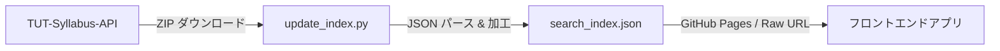

# 🔍 TUT Syllabus Search Engine

[TUT-Syllabus-API](https://github.com/Cybroad/TUT-Syllabus-API) のデータを取得・加工し、検索に最適化されたインデックスファイル (`search_index.json`) を生成・配信するリポジトリです。

## 概要

豊田工業大学（TUT）のシラバス情報を一括で取得し、フロントエンドから直接利用可能な静的 JSON ファイルとして公開します。GitHub Actions による週次自動更新で、常に最新のシラバスデータを保持します。

## 仕組み



1. **データ取得** — `update_index.py` が TUT-Syllabus-API リポジトリを ZIP 形式でダウンロード
2. **パース & 加工** — ZIP 内の全講義 JSON (`/api/v1/all/` 配下) を読み込み、元データの全フィールドを維持しつつ検索用カスタムフィールド (`search_times`) を追加
3. **インデックス生成** — 加工した全講義データを `search_index.json` として出力
4. **自動更新** — GitHub Actions が毎週日曜日に自動実行し、最新データをコミット & プッシュ

## データ構造

`search_index.json` の各エントリには以下のフィールドが含まれます。

| フィールド | 型 | 説明 |
|---|---|---|
| `lectureCode` | `string` | 講義コード |
| `courseName` | `string` | 科目名 |
| `lecturer` | `string[]` | 担当教員 |
| `regularOrIntensive` | `string` | 通常 / 集中 |
| `courseType` | `string` | 科目区分 |
| `courseStart` | `string` | 開講時期 |
| `classPeriod` | `string[]` | 時限（例: `["月1", "月2"]`） |
| `targetDepartment` | `string` | 対象学科 |
| `targetGrade` | `string[]` | 対象学年 |
| `numberOfCredits` | `number` | 単位数 |
| `classroom` | `string[]` | 教室 |
| `courseDetails` | `object` | 講義詳細（目的・計画など） |
| `updateAt` | `string` | 最終更新日 |
| `search_times` | `object[]` | 🆕 検索用時限データ（`day` + `period`） |

### `search_times` の例

```json
[
  { "day": "月", "period": 1 },
  { "day": "月", "period": 2 }
]
```

曜日と時限を構造化することで、フロントエンドでの時間割フィルタリングを容易にしています。

## セットアップ

### 前提条件

- Python 3.10+
- `requests` ライブラリ

### ローカル実行

```bash
pip install requests
python update_index.py
```

実行すると、カレントディレクトリに `search_index.json` が生成されます。

## 自動更新 (GitHub Actions)

`.github/workflows/sync.yml` により、以下のスケジュールで自動更新されます。

- ⏰ **毎週日曜日 UTC 00:00**（JST 09:00）に自動実行
- 🔘 GitHub の Actions タブから**手動実行**も可能

## ライセンス

[MIT License](LICENSE) © 2026 Rinia