# 🔍 TUT Syllabus Search Engine

[TUT-Syllabus-API](https://github.com/Cybroad/TUT-Syllabus-API) のデータを取得・加工し、全体および学部別の検索用インデックスファイルを生成・管理するリポジトリです。

## 概要

東京工科大学（TUT）のシラバス情報を一括で取得し、検索に最適化された静的 JSON ファイルとして管理します。GitHub Actions による定期自動更新で、常に最新のシラバスデータを保持します。

## 仕組み

```mermaid
flowchart LR
    A[TUT-Syllabus-API] -->|ZIP ダウンロード| B[update_index.py]
    B -->|JSON パース & 加工| C[search_index.json]
    B --> D[api/hachioji/ & api/kamata/]
    C & D -->|Raw URL| E[フロントエンドアプリ]
```



1. **データ取得** — `update_index.py` が TUT-Syllabus-API リポジトリを ZIP 形式でダウンロード
2. **パース & 加工** — ZIP 内の全学部ディレクトリの講義 JSON を読み込み、検索用カスタムフィールド (`search_times`) を追加
3. **インデックス生成** — 全体 (`search_index.json`) + キャンパス/課程/学部別に分割出力
4. **自動更新** — GitHub Actions が TUT-Syllabus-API の更新翌日（3ヶ月毎）に自動実行し、最新データをコミット & プッシュ

## データ構造

`search_index.json` の各エントリには以下のフィールドが含まれます。

| フィールド | 型 | 説明 |
|---|---|---|
| `lectureCode` | `string` | 講義コード |
| `courseName` | `string` | 科目名 |
| `lecturer` | `string[]` | 担当教員 |
| `regularOrIntensive` | `string` | 科目区分 |
| `courseType` | `string` | 授業形式 |
| `courseStart` | `string` | 開講時期 |
| `classPeriod` | `string[]` | 時限（例: `["月1", "月2"]`） |
| `targetDepartment` | `string` | 対象学科 |
| `targetGrade` | `string[]` | 対象学年 |
| `numberOfCredits` | `number` | 単位数 |
| `classroom` | `string[]` | 教室 |
| `updateAt` | `string` | 最終更新日 |
| `search_times` | `object[]` | 🆕 検索用時限データ（`day` + `period`） |

### `search_times` の例

```json
[
  { "day": "月", "period": 1 },
  { "day": "月", "period": 2 }
]
```

曜日と時限を構造化することで、フロントエンドでの時間割フィルタリングを容易にしています。

## セットアップ

### 前提条件

- Python 3.10+
- `requests` ライブラリ

### ローカル実行

```bash
pip install requests
python update_index.py
```

実行すると、`search_index.json` と `api/` ディレクトリが生成されます。

## データの利用方法

GitHub の Raw URL 経由で JSON を取得できます。

### エンドポイント一覧

ベース URL: `https://raw.githubusercontent.com/<user>/<repo>/main/`

| パス | 内容 |
|------|------|
| `search_index.json` | 全講義データ |
| `api/all.json` | 全講義データ（同内容） |
| `api/departments.json` | キャンパス・課程・学部メタデータ |
| `api/{campus}/{level}/{dept}/all.json` | 学部の全講義 |

> - `{campus}`: `hachioji`（八王子）, `kamata`（蒲田）
> - `{level}`: `university`（大学）, `graduate`（大学院）

### 学部コード

#### 八王子キャンパス

| 課程 | コード | 学部 |
|------|--------|------|
| 大学 | `CS` | コンピュータサイエンス学部 |
| 大学 | `MS` | メディア学部 |
| 大学 | `BT` | 応用生物学部 |
| 大学 | `ES` | 工学部 |
| 大学 | `X1` | 教養学環 |
| 大学院 | `GF` | 大学院 |

#### 蒲田キャンパス

| 課程 | コード | 学部 |
|------|--------|------|
| 大学 | `DS` | デザイン学部 |
| 大学 | `HS` | 医療保健学部 |
| 大学 | `X3` | 教養学環 |
| 大学院 | `GH` | 大学院 |

### 使用例 (Swift)

```swift
let base = "https://raw.githubusercontent.com/<user>/<repo>/main"

// メタデータ取得
let metaURL = URL(string: "\(base)/api/departments.json")!
let (metaData, _) = try await URLSession.shared.data(from: metaURL)
let meta = try JSONDecoder().decode([String: [String: [DeptInfo]]].self, from: metaData)

// MS学部の全講義を取得
let msURL = URL(string: "\(base)/api/hachioji/university/MS/all.json")!
let (msData, _) = try await URLSession.shared.data(from: msURL)
let ms = try JSONDecoder().decode([Lecture].self, from: msData)

// 月1の講義だけフィルタ
let monday1st = ms.filter { lecture in
    lecture.searchTimes.contains { $0.day == "月" && $0.period == 1 }
}
```

### レスポンス

JSON 配列形式で講義データが返却されます。各要素の構造は上記「データ構造」セクションを参照してください。

## 自動更新 (GitHub Actions)

`.github/workflows/sync.yml` により、TUT-Syllabus-API の更新に追従して自動更新されます。

- ⏰ **3ヶ月毎の2日 UTC 00:00**（JST 09:00）に自動実行（TUT-Syllabus-API 更新翌日）
- 🔘 GitHub の Actions タブから**手動実行**も可能

## ライセンス

[MIT License](LICENSE) © 2026 Rinia